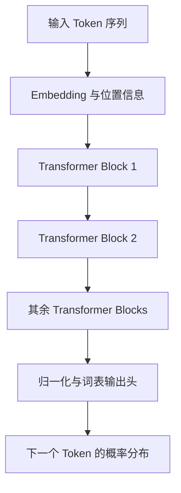
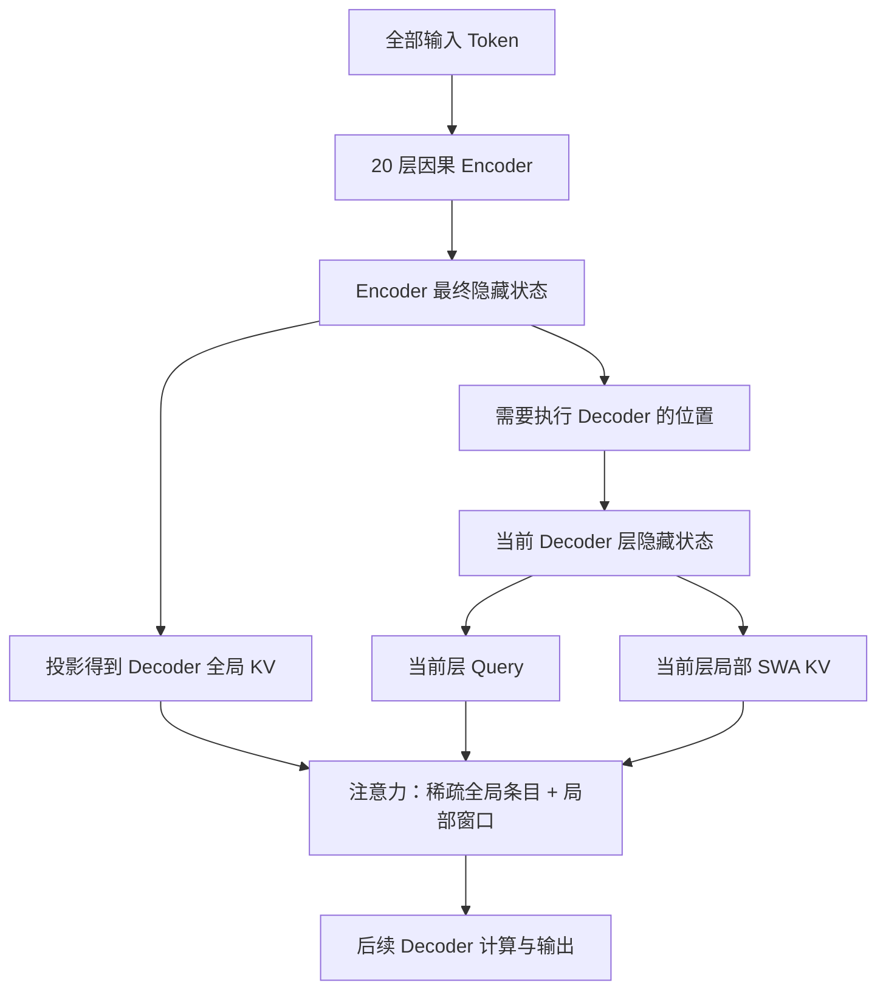

## 1. DeepSeek-V4.1-Flash 火了之后，值得往里面看一眼

最近 DeepSeek-V4.1-Flash 很火。不少人已经把它用进了日常工作，从写代码、读项目，到让 Agent 连续调用工具完成任务。随着使用的人越来越多，围绕它的讨论也不再只是发布时的跑分，而是更具体的问题：实际任务做得怎么样，长上下文用起来顺不顺，能不能成为每天都会打开的那个模型。

一个模型受到关注，往往先是因为好用。效果不错，大家愿意继续用，接着才会好奇：这一代到底改了什么？除了训练数据和后训练，模型内部有没有一些值得仔细看看的变化？

翻开 DeepSeek-V4.1-Flash 的技术报告，CED 就是这样一个值得停下来看的设计。它的全称是 **Causal Encoder–Decoder，因果编码器—解码器**。名字听起来像是又回到了熟悉的 Encoder 和 Decoder，但它做的事情，并不是简单地把模型分成“负责读”的一半和“负责写”的一半。[[1]](#ref1)

报告里有一组很能引起好奇的数字：处理输入时，每个 token 激活约 8B 参数；生成输出时，则是约 16B。我们平时把输入和输出都叫作 token，为什么送进同一个模型，走过的计算路径却可以不一样？

这就是这篇文章想聊的事情。当然，不能把模型好用的原因全部归给 CED，数据、训练和其他架构设计同样重要。我们先把范围缩小一点，看看 CED 怎样改变模型处理上下文的方式，又为什么能省下一部分计算。

要把这件事说清楚，最好的起点不是直接看 CED 的结构图，而是回到大家更熟悉的 GPT：**它怎样读入一段话，又怎样一个 token 接一个 token 地生成回答？**理解了原来的过程，再看 CED 的改动，就容易得多。

## 2. GPT 架构是什么：一条逐层更新表示的因果网络

### 2.1 Decoder-only 不等于“只处理输出”

GPT 采用的典型结构是 Decoder-only Transformer。这里的 Decoder 是结构名称，不是说它只能处理模型生成的文字。

用户输入、系统指令、历史对话和已经生成的 token，都会成为序列的一部分。模型通过因果注意力保证：位置 $t$ 只能访问自己及更早的位置，不能偷看未来。



一个 Block 中包含注意力、前馈网络、归一化与残差连接等。本文不逐个展开这些组件，先抓住一件事：**同一个 token 的表示会沿着网络逐层更新，不同层拿到的不是同一份隐藏状态。**

### 2.2 Q、K、V 从哪里来？

把第 $l$ 层注意力的输入记作 $H^{(l)}$。暂时省略归一化、位置编码和多头拆分，标准投影可写成：

$$
Q^{(l)} = H^{(l)}W_Q^{(l)},\qquad
K^{(l)} = H^{(l)}W_K^{(l)},\qquad
V^{(l)} = H^{(l)}W_V^{(l)}.
$$

可以把三者的职责理解成：

| 表示 | 作用 | 当前位置如何使用它 |
| --- | --- | --- |
| Q，Query | 表达当前位置需要查询什么 | 拿它与允许访问的 K 做匹配 |
| K，Key | 表达一个位置如何被匹配 | 决定该位置获得多少注意力 |
| V，Value | 提供被汇聚的信息 | 按注意力权重参与加权求和 |

单个注意力头的简化计算是：

$$
\operatorname{Attention}(Q,K,V)
=\operatorname{softmax}\left(\frac{QK^\top}{\sqrt{d_k}}+M\right)V,
$$

其中 $M$ 是因果掩码，将不允许访问的未来位置屏蔽掉。

注意力输出继续经过后续计算，得到下一层的输入 $H^{(l+1)}$。因此，第 20 层的 K/V 并不能直接用原始 token 算出来：它们依赖 token 到达第 20 层时的表示。

这里采用标准多头注意力作为基线。实际 Decoder-only 模型可能使用 GQA、MLA、滑动窗口或稀疏注意力，不能把所有模型都等同于这个基础版本。

## 3. 一次 GPT 推理，为什么分成 Prefill 和 Decode？

假设输入是四个 token `[A B C D]`，模型接下来生成 `[E F ...]`。

### 3.1 Prefill：计算已知输入，建立历史状态

输入的四个 token 都已经确定，因此可以在每一层内批量处理这些位置，同时用因果掩码限制可见范围：

```text
A 只能看 A
B 可以看 A B
C 可以看 A B C
D 可以看 A B C D
```

这就是 prefill，通常译作“预填充”。它不是把文字复制到某个缓存里，而是执行真实的模型前向计算：

1. 将输入 token 转成表示。
2. 逐层计算注意力和前馈网络。
3. 保留每层的历史 K/V，供后续生成使用。
4. 利用最后一个输入位置 D 的最终表示，预测第一个输出 E。

同一层可以并行处理多个已知位置，不代表层间也能跳过依赖：第 2 层仍然需要第 1 层的结果。

### 3.2 Decode：处理新 token，复用旧 KV

得到 E 之后，把 E 输入模型。每一层为 E 计算新的 Q/K/V，用 E 的 Q 查询历史 KV 和 E 自己的 KV，最终预测 F；E 的 KV 也会保留在缓存中，供后续步骤使用。

```text
Prefill：
[A B C D] -> 所有层 -> 建立 A B C D 的各层 KV -> 预测 E

Decode 第一步：
[E] + 已有各层 KV -> 所有层 -> 追加 E 的各层 KV -> 预测 F

Decode 第二步：
[F] + 已有各层 KV -> 所有层 -> 追加 F 的各层 KV -> 预测下一个 token
```

在确定的因果网络中，追加未来 token 不会改变旧位置的表示，这使历史 K/V 可以复用。历史 Q 通常不需要保留，因为当前步骤需要的是新位置的查询，而不是重新计算旧位置的输出。

**KV Cache 节省的是历史位置的重复计算，不是让新 token 绕过整个模型。**新 token 通常仍要逐层处理，注意力仍要读取它需要的历史信息。

Prefill 与 decode 是同一个自回归模型的两种执行形态，而不是两个不同的训练任务。实际服务系统还可能使用分块 prefill、连续批处理与推测解码，本文先讨论最基本的路径。

## 4. GPT 式结构的约束：准备深层 KV，需要先算出深层表示

现在可以提出一个更具体的问题：既然输入部分只需要最后一个位置预测 E，为什么前面的 A、B、C 也需要经过深层网络？

因为 E 在第 $l$ 层需要查询历史位置在这一层的 K/V，而这些 K/V 来自历史位置的 $H^{(l)}$。

```text
历史 token A
    -> 第 1 层的表示与 KV
    -> 第 2 层的表示与 KV
    -> ...
    -> 第 l 层的表示与 KV
                 ↑
      新 token 在第 l 层需要读取这里
```

**省略 A、B、C 的词表预测，不等于可以省略它们建立深层 KV 所需的计算。**这就是输入处理与整套网络深度之间的耦合。

这种结构还有存储上的代价。在最基础、每层独立缓存的实现中，忽略批次和其他开销，KV 容量可粗略写成：

$$
M_{\mathrm{KV}}\approx
2\times N\times L\times n_{\mathrm{kv}}\times d_{\mathrm{head}}\times b.
$$

这里 $N$ 是上下文长度，$L$ 是层数，$n_{\mathrm{kv}}$ 是 KV 头数，$d_{\mathrm{head}}$ 是每头维度，$b$ 是每个元素的字节数；前面的 2 对应分别保存 K 与 V。

不同注意力设计会改变这个公式，但它揭示了优化方向：减少每条缓存的大小、减少序列条目、减少跨层重复，或者降低存储精度。

这些并非 GPT 的“错误”，而是表达能力与计算、存储成本之间的取舍。CED 选择进一步追问：**深层计算是否必须同时承担“为历史建立全局 KV”和“为当前位置生成输出”这两项职责？**

## 5. CED 的核心：改变 Decoder 全局 KV 的来源

### 5.1 不是简单地把 40 层命名成两半

DeepSeek-V4.1-Flash 的语言主干有 40 层：前 20 层作为因果 Encoder，后 20 层作为 Decoder。两部分依然构成自回归语言模型，所有层仍遵守因果约束。[[1]](#ref1)

改变的重点是后半部分的**全局注意力**。

将 Encoder 最终输出记为 $E=H_{\mathrm{enc}}$。按照技术报告第 2.2 节，Decoder 的全局 KV 条目与压缩权重从这份输出投影：

$$
C^{(l)}=E W_{KV}^{(l)},\qquad
Z^{(l)}=E W_Z^{(l)}.
$$

其中 $C$ 是待组织成全局 KV 的表示，$Z$ 是用于压缩的权重信号。这个公式表达的是来源关系；具体是否需要序列压缩，还取决于压缩率，不能理解成每层总会执行完全相同的压缩操作。

与 GPT 式基线对照：

| 比较项 | 标准逐层自注意力 | CED 的 Decoder 全局分支 |
| --- | --- | --- |
| 历史 KV 来源 | 各层自己的输入隐藏状态 | Encoder 的最终隐藏状态 |
| 生成历史全局 KV 的依赖 | 历史位置必须先到达对应层 | Encoder 输出准备好后即可投影 |
| 当前 Query | 来自当前层状态 | 仍来自当前层状态 |
| 全部历史位置是否都要执行 Decoder | 通常需要，以建立逐层历史 KV | 全局 KV 构建不再要求这样做 |

**CED 解开的是全局 KV 构建对 Decoder 深层历史计算的依赖，而不是取消 Decoder。**

### 5.2 为什么 Encoder 也必须是 Causal？

如果 Encoder 可以双向查看整个序列，追加一个新 token 后，旧位置就可能需要吸收这个新 token 的信息，已有表示和缓存也可能随之改变。

因果 Encoder 不会读取未来。对固定参数和相同计算路径，前缀的表示不因后续追加而改变，因此可以增量处理序列，并让生成的 token 继续成为可查询的历史。

所以，这不是传统机器翻译中“先双向编码一个固定源句，再解码目标句”的简单复刻。这里的序列还在不断增长，生成的新 token 同样要经过 Encoder。

### 5.3 还有一条不能忽略的局部路径

CED 并没有把 Decoder 的所有 KV 都移到 Encoder 输出上。

DeepSeek-V4.1-Flash 保留逐层的滑动窗口注意力 SWA。局部窗口的 KV 仍然从各层自身的隐藏状态生成；这保留了较深的局部信息处理能力，也留下了 prefill 时必须解决的状态准备问题。[[1]](#ref1)



图中省略了残差、归一化、MoE 和索引器细节。此时先记住：**全局历史信息与逐层局部状态，走的是两条不同的来源路径。**

## 6. 放大 Attention：低秩 Q 和共享 KV 分别在做什么？

CED 解释了全局 KV“从哪里来”。要理解实际计算，还要看 Query 如何生成、K/V 如何表示，以及哪些状态可以跨层复用。

这些机制共同出现在该模型中，但不应全都归为 CED 首次提出的创新。

### 6.1 低秩 Q：先形成紧凑查询，再展开成多个头

标准的直接投影，把隐藏状态一次性映射为全部 Query 头。参考实现中的 Query 路径则是：[[3]](#ref3)

```text
当前层隐藏状态 x
    -> wq_a：映射到低维查询表示
    -> q_norm：RMSNorm
    -> wq_b：展开为多个 Query 头
    -> 在指定维度应用 RoPE
```

对应的简化公式是：

$$
u_t=\operatorname{RMSNorm}(x_tW_{Q,a}),\qquad
q_t=\operatorname{reshape}(u_tW_{Q,b}).
$$

技术报告给出的隐藏维度是 5120，Query 压缩维度是 1280，Query 头数为 64，每头维度为 512。因此，主 Query 投影大致沿着以下维度变化：

```text
5120 -> 1280 -> 64 × 512
```

仅比较这部分矩阵参数量，忽略归一化等小项：

$$
\begin{aligned}
P_{\mathrm{direct}} &= 5120\times(64\times512)
\approx167.8\text{M},\\
P_{\mathrm{factorized}} &=5120\times1280
+1280\times(64\times512)
\approx48.5\text{M}.
\end{aligned}
$$

这个比较展示了因子化投影怎样控制宽 Query 投影的参数与乘加开销，不是整个模型的参数节省比例，也不是与上一代模型的实测对比。中间有 RMSNorm，因此不能把完整映射简单等同于一个固定矩阵的无损低秩分解。

另外，代码中的 `q_lora_rank` 指这里的查询瓶颈维度，不能直接理解成“推理时额外挂了一份 LoRA 微调适配器”。

**低秩 Q 主要优化查询分支，不直接解释历史 KV Cache 为什么变小。**历史 Q 本来通常就不需要长期缓存。

### 6.2 K/V 共享表示：一份向量参与匹配与信息汇聚

在标准教学公式里，K 和 V 是两份分别投影的表示。参考实现的主注意力则围绕一份 `kv` 表示工作：局部分支由 `wkv` 和 `kv_norm` 生成，注意力内核接收 `q` 与 `kv`，而不是两份独立的主 K、V 张量。[[3]](#ref3)

为理解这种共享，可先忽略 RoPE、量化、attention sink 与稀疏选择，写成示意：

$$
c_j=\operatorname{Norm}(s_jW_{KV}),\qquad
\alpha_{tj}^{(h)}\propto
\exp\left(\frac{q_t^{(h)\top}c_j}{\sqrt{d}}\right),\qquad
o_t^{(h)}=\sum_j\alpha_{tj}^{(h)}c_j.
$$

这里 $s_j$ 表示对应分支的来源状态：Decoder 全局分支来自 Encoder 输出，局部分支来自当前层状态。多个 Query 头以不同的查询读取共享的 KV 表示。

它不是先生成完整的多头 K/V，再把两份数组简单合并；模型本身就在这样的表示约束下进行计算和训练。

实际代码还对 KV 的部分维度应用 RoPE，并在注意力输出的相应维度执行逆旋转，所以以上公式只是说明“同一份表示承担匹配和汇聚”的结构，不能作为逐算子等价实现。

这种设计减少了分别为各头保存独立 K、V 表示的需求，但索引器 K、量化尺度和局部窗口仍有自己的开销，不能据此直接宣称整套缓存恰好减半。

### 6.3 跨层共享：CSA2 进一步减少重复缓存

“同一份向量承担 K/V”与“不同层复用同一份缓存”是两个维度。CED 的全局来源关系，也不自动意味着所有层只能使用完全相同的投影权重。

跨层怎样共享，由 CSA2 的三种静态模式进一步规定：[[1]](#ref1)

| 模式 | 全局 main KV 与 indexer K | Top-K 位置 | 当前层主 Q 与 SWA KV |
| --- | --- | --- | --- |
| Full | 生成新的一组 | 重新选择 | 自己计算 |
| Reindex | 复用前面的 Full 层 | 用自己的索引查询重新选择 | 自己计算 |
| Reuse | 复用前面的 Full 层 | 复用最近的索引结果 | 自己计算 |

“Full”指这组组件完整执行，并不代表这一层改成全量稠密注意力。

发布模型的 Encoder 前两层只使用 SWA；后 18 层分成三组，每组六层，由一层 Full 和五层 Reuse 组成，序列压缩率为 2。Decoder 的 20 层只有首层是 Full，后面安排 Reindex 与 Reuse，序列压缩率为 1。[[1]](#ref1)

因此，**Decoder 的全局 KV 可以跨层共享，但各层的查询与局部 SWA 状态仍然不同**。读取同一份历史表示，不代表每层执行相同的注意力或得到相同输出。

压缩率为 1 也值得注意：Decoder 的全局分支没有通过“每两个 token 合成一个条目”来缩短序列，依然可以依靠紧凑表示、跨层复用、稀疏访问与低精度存储控制成本。

## 7. 再走一遍 Prefill：CED 到底省掉了什么？

这是前面所有结构说明要回答的问题。

### 7.1 全局 KV 已经不用等待完整 Decoder 前向

对一段尚未缓存的输入，先让所有位置经过 20 层 Encoder，得到 Encoder 输出。随后便可以构造 Decoder 需要的全局 KV，而不必让每个历史位置都经过 20 层 Decoder。

但到这里还不能结束：Decoder 的局部 SWA KV 没有准备好，首个输出也需要 Decoder 的计算结果。

### 7.2 为什么只重算一个窗口，不是严格无损的？

假设每层 SWA 的窗口大小是 $W$。某个位置在当前层只看最近 $W$ 个位置，但这些位置的隐藏状态，又可能在前一层读取更早的位置。

**局部依赖会跨层向前扩展。**因此，从缺失状态开始严格恢复多层 SWA，所需历史范围并不只是一个窗口。报告用 $L\times W$ 量级说明跨 $L$ 层精确恢复的回放范围。[[1]](#ref1)

CED 采用 Decoder SWA Bounded Replay：只让输入末尾 $W$ 个 token 的 Encoder 输出经过 Decoder，并把回放时的局部注意力截断在这段内部。

对回放起点 $s$ 和当前位置 $i$，局部可见范围是：

$$
[\max(s,i-W+1),\ i].
$$

全局分支仍可读取已建立的、因果允许的历史全局 KV；截断的是局部 SWA 回放范围，不是把所有更早的上下文都丢掉。

这会得到**近似的 Decoder 局部状态**，不是完整前向的数学等价替代。报告称实验中质量影响很小，并在后训练中模拟同样的回放进行适应；这个结论不能扩大成任何任务都绝无影响。[[1]](#ref1)

### 7.3 首个输出从哪里来？

以发布模型的 $W=128$ 为例，冷启动 prefill 的概念路径是：

```text
全部 N 个输入 token
    -> 20 层 Encoder
    -> 建立 Encoder 状态和 Decoder 全局 KV

最后 min(N, 128) 个位置的 Encoder 输出
    -> 20 层 Decoder，执行有界 SWA 回放
    -> 准备 Decoder 的局部 SWA KV
    -> 最后输入位置的 Decoder 输出进入词表头
    -> 预测第一个输出 token
```

最后输入位置也在尾部回放段中，因此仍能完成输出预测。这里是根据报告的数据依赖描述整理的执行示意，不是声称官方生产系统只有这一种内核调用或调度顺序。

对前面的 `[A B C D]` 小例子，如果窗口足以包含四个位置，它们都会经过 Decoder；短输入并不具备“大部分历史绕过 Decoder”的空间。要看到这种优化的价值，需要输入长度明显大于回放窗口。

### 7.4 “Prefill 近乎减半”如何推出来？

只用“处理多少个 token-layer”作为粗略计算量指标：标准路径需要 $NL$；CED 配合有界回放需要：

$$
N\frac{L}{2}+\min(N,W)\frac{L}{2}.
$$

当 $N\gg W$ 时，相对于完整路径的比例约为：

$$
\frac{NL/2+WL/2}{NL}
=\frac12+\frac{W}{2N}.
$$

假设 $N=32768$、$L=40$、$W=128$：

| 路径 | 示例中的 token-layer 数 |
| --- | ---: |
| 全部输入执行 40 层 | 1,310,720 |
| CED：全部输入执行 20 层，尾部 128 个位置再执行 20 层 | 657,920 |

这个教学估算约为原来的 50.2%。它帮助解释报告的主导项，但不是 FLOPs 实测，更不是“响应时间必然减半”的证明。不同层成本、全局投影、注意力读取、MoE 通信与调度都没有在这个计数中展开。

官方的“prefill 每 token 激活 8B 参数、decode 每 token 激活 16B 参数”，应结合这种主路径理解，不能解释成 prefill 期间任何位置都绝不执行 Decoder。[[1]](#ref1)[[2]](#ref2)

## 8. Decode 呢？新 token 仍然经过两部分网络

Prefill 预测出 E 后，下一步处理 E：

1. E 经过 Encoder，读取已有历史并产生新的 Encoder 输出。
2. 根据新的 Encoder 输出更新 Decoder 全局 KV；Encoder 的压缩条目按其分组规则更新。
3. E 的表示继续经过 Decoder。各层生成自己的 Q 与局部 SWA KV，读取共享的全局历史表示。
4. 最终输出预测 F。

```text
E -> Encoder -> E 的 Encoder 输出 -> Decoder -> 预测 F
                    |
                    +-> 更新 Decoder 全局 KV
```

因此，“Encoder 负责输入，Decoder 负责输出”只能作为非常粗略的概括。更准确地说：

> **绝大部分长输入位置可以只执行 Encoder 主路径；但自回归生成时，新 token 仍要经过 Encoder 和 Decoder。**

CED 没有把生成从因果序列中分离出去，也没有让模型一次性知道未来所有输出。本文不展开 DSpark 推测解码，以免把减少单步开销与减少串行验证步骤混在一起。

## 9. 多轮缓存命中时，为什么还需要 Encoder Bounded Replay？

前面讨论的是 Decoder 局部状态的准备。对于多轮对话，还有另一种状态缺失：历史全局 KV 已经命中，但 Encoder 的局部 SWA 状态不在了。

技术报告将长期保存的全局 KV 与短期活跃会话的局部状态分开管理，不再要求把 SWA KV 一起长期写入 SSD。Encoder SWA 状态缺失时，系统回放已缓存前缀的最后 $W$ 个 token，并与未缓存的后缀一起处理。[[1]](#ref1)

这里有一个关键约束：

| 处理部分 | 全局 KV | 局部 SWA KV |
| --- | --- | --- |
| 回放的已缓存前缀 | 复用已有结果，不重算或覆盖 | 重新生成 |
| 未缓存的新后缀 | 新生成 | 新生成 |

这避免为了恢复短期局部状态，而重新计算整段长期历史。但它仍然是近似恢复：报告明确指出，新后缀的状态可能依赖缓存命中的位置，不能保证与另一种命中边界下的状态数学一致。

需要区分两个用途：**Decoder Bounded Replay 让大部分输入不必执行 Decoder；Encoder Bounded Replay 则在局部缓存缺失时支持较便宜的前缀复用。**两者都不是“把全部上下文重新跑一遍”。

## 10. 收益要逐项归因，不能全部记在 CED 名下

现在可以把架构中的不同设计与收益对应起来：

| 设计 | 主要改变什么 | 不能直接推导的结论 |
| --- | --- | --- |
| CED 全局 KV 来源解耦 | 减少准备全局历史状态对 Decoder 深层计算的依赖 | Decoder 可以完全删除 |
| Decoder SWA Bounded Replay | 把 Decoder 的 prefill 限定到尾部短窗口 | 与完整前向严格等价 |
| 低秩 Q 投影 | 控制查询投影的参数和计算开销 | 历史 KV 因此减半 |
| K/V 共享表示 | 用紧凑表示承担匹配与汇聚，供多个查询头访问 | 全部缓存只有一份向量 |
| CSA2 跨层 KV 与索引复用 | 减少重复缓存及部分重复索引计算 | 每层查询和局部状态也相同 |
| FP4 main KV | 降低主全局缓存的元素存储成本 | 权重、索引和所有局部缓存都是 FP4 |
| Encoder SWA Bounded Replay | 允许局部状态缺失时通过少量重算恢复 | 缓存命中边界不影响数值结果 |

官方报告给出的全局 KV 占用为每 token 890 字节，约为 DeepSeek-V4-Flash 的四分之一；持久 KV 占用约为上一代的八分之一。前者是 CSA2、缓存精度等设计共同作用的结果，后者还涉及不再持久保存 SWA KV 的部署策略。[[1]](#ref1)

这些数字的口径不是“整个模型的显存”或“每次请求的总成本”。模型权重、局部运行时状态、中间激活、工作区以及并行通信都不在一个简单的全局 KV 字节数中。

CED 最直接的受益场景是**需要处理大量新输入或未缓存输入的长上下文请求**。如果绝大部分输入已经命中前缀缓存，或者输入很短、输出很长，端到端收益结构就会不同。是否真的更快，还需要在具体硬件和服务实现上测量首 token 延迟、生成速度、吞吐与缓存 I/O。

## 11. 读参考代码时，别把“可以优化”当成“已经实现”

官方最小推理代码有助于核对 Attention 的局部算子，但它的 README 将自己定位为可读的参考实现，而不是生产服务引擎。[[3]](#ref3)[[4]](#ref4)

在本文核对的 `inference/model.py` 中，可以直接看到：

```python
qr = self.q_norm(self.wq_a(x))
q = self.wq_b(qr).unflatten(-1, (self.n_local_heads, self.head_dim))
```

以及 `wkv`、`kv_norm`、`shared_attn.compress_kv`、`shared_attn.topk_idxs` 等用于表示和复用的组件。

但同一份代码的 `Transformer.forward` 主循环仍逐层调用全部 Block，不能据此宣称它已经实现了报告中的“Encoder 全序列 + Decoder 尾部有界回放”服务路径。其全局 KV 构造代码也不能替代技术报告对 CED 来源关系的定义。

因此，本文以技术报告第 2.2 节和第 3.2.2 节说明 CED 与回放机制，以参考代码佐证低秩 Q、共享 KV 及跨层复用的局部实现。本文没有部署模型或实测推理性能，也不把代码中的小模型默认配置当成发布模型的实际尺寸。

## 12. 总结：CED 改变的是“哪些位置必须算到多深”

从 GPT 出发，这条逻辑可以连起来：

1. 标准 GPT 式结构中，历史 KV 来自各层隐藏状态，准备深层 KV 通常要求历史位置经过前面的全部计算。
2. Prefill 因此不仅是读取输入，还要为后续 decode 建立逐层历史状态；只需要最后位置的预测，并不能自然跳过其余位置的深层计算。
3. CED 让 Decoder 全局 KV 改从 Encoder 最终输出生成，解除这部分历史状态对 Decoder 深层计算的依赖。
4. 低秩 Q、K/V 共享表示与 CSA2 分别控制查询开销、表示大小和跨层重复，不能混为同一种优化。
5. 保留逐层 SWA 意味着仍需局部状态；Bounded Replay 用短窗口近似重建，才使长输入的大部分位置真正能够绕过 Decoder。
6. 生成新 token 时，两部分网络仍然一起工作，模型依旧进行自回归预测。

**CED 不是简单把 GPT 切成两半，而是重新安排历史信息的生成和读取：让全局历史表示不再绑定每层 Decoder 的计算，让更深的处理集中在当前生成位置与必要的局部窗口上。**

这也解释了为什么理解 CED 不能只看“20 + 20 层”或缓存压缩倍数。真正需要追踪的是：每份状态从哪里来，下一步依赖什么，以及改变来源以后，哪些工作终于可以不做。

## 参考资料

资料核对截至 2026 年 9 月 20 日。本文以标准 GPT 式 Decoder-only Transformer 为教学对照，不描述某个未公开的 GPT 产品。CED 的直接架构背景包括 DeepSeek-V4 与 YOCO；文中的简化公式和执行示意用于解释数据依赖，不替代完整实现。

<a id="ref1"></a>

1. DeepSeek-AI. [DeepSeek-V4.1-Flash: Pushing the Limits of KV Cache Compression](https://huggingface.co/deepseek-ai/DeepSeek-V4.1-Flash/blob/main/DeepSeek_V41_Tech_Report.pdf). 重点参见第 2.2 节 CED、第 2.3 节 CSA2、第 3.2.1 节持久 KV 管理、第 3.2.2 节 SWA Bounded Replay，以及第 4.2.1 节模型配置。报告将 CED 的直接灵感归于 YOCO。

<a id="ref2"></a>

2. DeepSeek-AI. [DeepSeek-V4.1-Flash 官方模型卡](https://huggingface.co/deepseek-ai/DeepSeek-V4.1-Flash/blob/main/README.md). 架构概述、参数口径与缓存占用摘要。

<a id="ref3"></a>

3. DeepSeek-AI. [最小推理参考实现：inference/model.py](https://huggingface.co/deepseek-ai/DeepSeek-V4.1-Flash/blob/main/inference/model.py). 重点查看 `Attention`、`Compressor`、`SharedAttentionRuntime` 与 `Transformer.forward`。链接指向可更新的 `main`，实现分析对应本文检索日期。

<a id="ref4"></a>

4. DeepSeek-AI. [Minimal inference README](https://huggingface.co/deepseek-ai/DeepSeek-V4.1-Flash/blob/main/inference/README.md). 说明参考实现的定位和覆盖范围。
