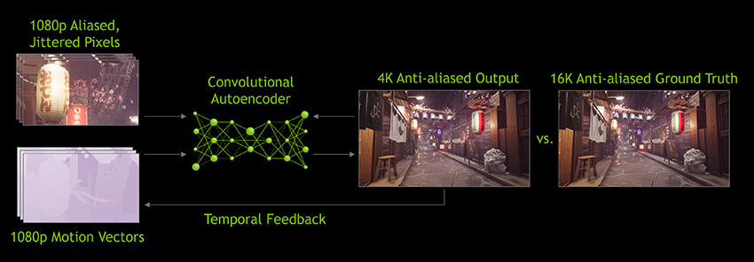
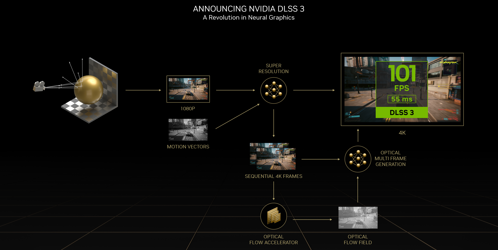
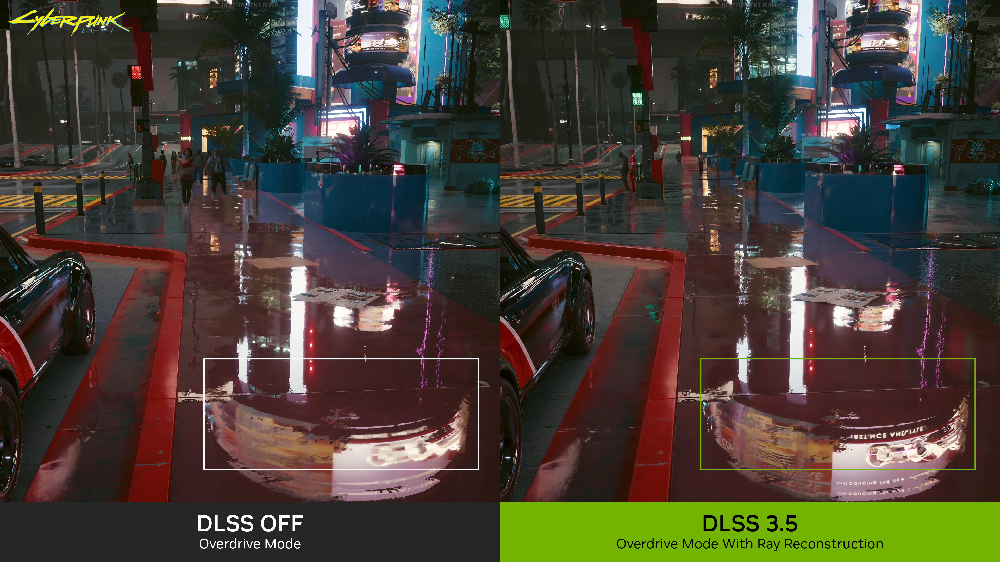
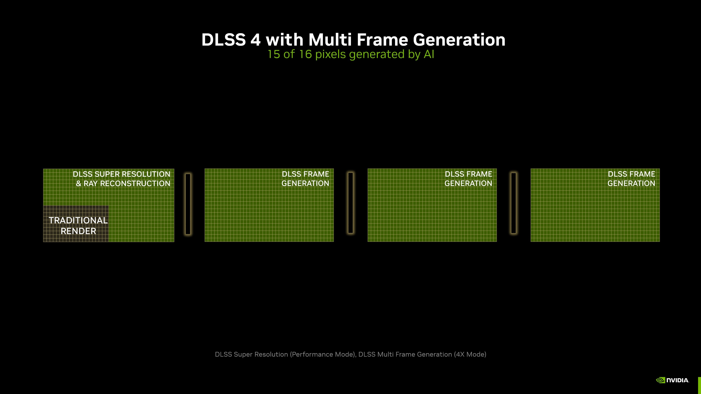

<a id="answer"></a>

## 先把时间拨回 DLSS 出现之前

如果你这几年玩过大型 PC 游戏，大概已经很熟悉 DLSS 这个选项了。游戏跑得吃力，先把它打开；还不够流畅，再看看能不能开帧生成。对不少玩家来说，DLSS 最直观的意义就是：不用立刻换显卡，也能把画质和帧率往上提一点。

但到了 DLSS 5，讨论开始有些不一样。人们关注的不再只是帧率计数器，而是人物的皮肤、场景的光照、材质的质感，以及另一个更敏感的问题：画面变得更逼真了，它还是开发者原来想呈现的样子吗？

一个最初用来降低渲染成本的技术，为什么会走到这一步？

要理解这个变化，直接从“3D 引导神经渲染”讲起，反而容易绕进去。我们不妨从 DLSS 诞生前那个最朴素的问题开始：**玩家想要更清楚、更真实、更流畅的画面，但显卡没有无限的时间把它算出来。**

## 1. 为什么最开始需要 DLSS：画面越来越贵，每帧时间却没有变多

游戏画面不是播放一张已经做好的图片。玩家转动视角以后，引擎要根据新的位置，处理几何、材质、光照、阴影和各种特效，再把结果变成屏幕上的像素。

目标是每秒 60 帧，一帧就只有约 16.7 毫秒；目标是每秒 120 帧，这个时间进一步缩短到约 8.3 毫秒。游戏逻辑、CPU 提交和 GPU 渲染需要协同完成，不能像离线电影那样花几分钟慢慢打磨一张图。

分辨率还在上涨。1920 × 1080 大约有 207 万个像素，3840 × 2160 则有约 829 万，是前者的四倍。这不意味着总渲染耗时必然变成四倍，因为几何、CPU 等工作不全随像素数量增长，但很多逐像素计算的压力确实会明显增加。

光线追踪又让这个矛盾更突出。更准确的反射、阴影和间接光照需要额外采样与计算，而玩家并不会因为开了光追，就愿意接受每秒十几帧。

最简单的办法当然是降低分辨率：先算一张小图，再放大到屏幕大小。问题是，普通放大可以把像素铺满屏幕，却不能凭空找回低分辨率输入中没有保留下来的细节。细线容易断，边缘有锯齿，远处纹理也可能糊成一片。

想象你在游戏里看远处的一排铁栏杆。高分辨率下，一根细栏杆还能占到几个像素；降低分辨率后，它可能细到连一个像素都占不满。把小图直接放大，只会把模糊和断裂一起放大，不会自动让每根栏杆重新变清楚。DLSS 要处理的，就是这类“少算以后丢掉的细节怎么重建”的问题。

于是问题变成了：**能不能仍然少算一些像素，但用一种更聪明的办法，把结果重建得接近高分辨率渲染？**

这就是 DLSS 最初切入的地方。它不是为了给游戏附加一个 AI 功能，而是希望在固定的帧时间里，用神经网络重建换取一部分昂贵的传统渲染工作。

<a id="evolution"></a>

## 2. DLSS 1：让神经网络学会把少算的像素补回来

2018 年，DLSS 随第一代 GeForce RTX 进入玩家视野。它的全称是 Deep Learning Super Sampling，通常译作深度学习超级采样。名字里有“采样”，但对玩家来说，最重要的是它想实现的效果：**引擎以较低分辨率渲染，模型重建出较高分辨率的画面。**[[1]](#ref1)[[4]](#ref4)

```text
传统思路：
引擎直接渲染高分辨率画面 -> 显示

DLSS 的基本思路：
引擎渲染较低分辨率画面 -> 神经网络重建 -> 高分辨率显示
```

这里的“学习”发生在训练阶段。模型从低质量输入与高质量参考之间学习重建规律，玩家运行游戏时，再由显卡上的 Tensor Cores 执行推理。它不是每次开游戏都重新训练，也不是把每帧传到云端等服务器修图。

这个方向很有吸引力，但第一代还有落地上的门槛。NVIDIA 在 DLSS 2 的回顾中明确提到，最初的 DLSS 需要针对每个新游戏训练网络；这意味着它并不是一套接上去就能广泛使用的通用方案。[[1]](#ref1)

同时，一张静止截图看起来不错，还不足以证明重建适合游戏。摄像机一动，细节能否保持稳定？远处的栏杆会不会闪？物体刚露出来的部分能不能及时恢复？这些才是玩家真正一直在看的东西。

所以，第一代留下的问题不仅是“怎样补得更清楚”，还有“怎样在连续运动中补得稳定，以及怎样让更多游戏用得上”。

## 3. DLSS 2：别只看这一帧，前面的画面也有信息

2020 年发布的 DLSS 2，把时序信息放到了重建过程的核心位置。它会结合当前低分辨率画面、引擎提供的运动矢量，以及之前的高分辨率输出，重建当前帧。[[1]](#ref1)

这件事其实很直观。假设镜头正在缓慢转动，上一帧出现过的一条栏杆，下一帧并不是全新的东西。只要知道它移动到了哪里，上一帧的信息就有机会继续利用，而不必每次只盯着当前这张小图猜测。

但这里还缺少一个关键环节：如果镜头和场景都不动，每一帧都在完全相同的位置采样，多看几遍同样的低分辨率画面，新细节从哪里来？

### 亚像素抖动：每一帧，稍微换个位置看

这就需要**亚像素抖动（sub-pixel jitter）**。引擎在渲染前，给投影施加不到一个渲染像素的微小偏移，让连续几帧的采样点落在不同位置。它有时也被称为时序抖动，因为这些空间偏移会随帧变化；这里的“亚”指小于一个像素，并不是让出帧时间忽快忽慢。NVIDIA 的集成说明明确要求检查 jitter 是否正确：缺失或错误的抖动会降低抗锯齿质量、增加闪烁。[[7]](#ref7)

可以把低分辨率采样想成隔着一张稀疏的打孔纸看细栏杆。如果每次都从同一组孔往外看，某根细栏杆可能一直落在孔之间。把纸轻轻错开一点，下一次就可能看到刚才漏掉的部分。渲染时的微小偏移做的就是类似的事：让不同帧带回互补的采样信息，而不是只重复同一份信息。

```text
同一个低分辨率像素覆盖的区域（简化示意）
┌─────────────────┐
│  ①         ③    │  ①②③④：四帧各自的采样位置
│                 │  每帧只展示一个采样点
│      ④          │  合起来能覆盖更细的位置
│           ②     │
└─────────────────┘
```

*这只是解释采样位置的示意，不是 DLSS 固定采用的四帧序列，也不意味着积累四帧就一定等价于原生高分辨率渲染。偏移发生在渲染采样阶段；把已经渲染好的同一张图片来回挪动，并不会增加这些场景信息。*

当然，游戏里的物体和镜头会动。运动矢量负责提供对应关系：场景里的内容从上一帧移动到了当前帧的什么位置。重建过程还要考虑已知的采样偏移，把历史信息对齐后，结合当前输入进行重建。最终显示的目标是稳定画面，不是把采样抖动直接展示给玩家。

这样，几个环节就接上了：**亚像素抖动提供互补采样，运动矢量帮助对齐历史，时序重建决定如何利用这些信息。**这种采样思路也用于传统时序抗锯齿（TAA），并非 DLSS 独有；DLSS 则用学习得到的模型参与重建。

### 有了更多采样，还要判断历史是否可信

```text
带亚像素抖动的当前帧 -----+
                         |
运动矢量：内容移动到哪里 --+-> 时序重建 -> 当前高分辨率帧
                         |                   |
上一帧的高分辨率输出 -----+                   +-> 留给下一帧使用
```



*图 1：DLSS 2.0 的官方重建流程。读图时先关注当前输入和历史反馈汇入网络的关系，不必先记住每个英文术语。图片来源：[NVIDIA DLSS 2.0 发布说明](https://www.nvidia.com/en-us/geforce/news/nvidia-dlss-2-0-a-big-leap-in-ai-rendering/)。*

但历史也不是越多越好。人物走开后露出的背景，上一帧可能根本没看见；快速运动时，旧信息也可能已经对不上。模型需要判断哪些历史还能用，哪些应该丢弃。判断不好，就会出现拖影、闪烁或者细节恢复不及时。

还是看那排栏杆：镜头向右移动一点，模型可以把上一帧栏杆的信息对齐到新位置。但如果一个人刚从栏杆前走开，他身后新露出的部分就不能直接沿用旧画面，否则人的轮廓可能残留在那里。**利用历史像是边看新画面、边翻上一张照片核对，而不是把旧照片直接盖上去。**

DLSS 2 的另一项重要变化，是从逐游戏训练转向可跨游戏使用的通用网络。它降低了推广与接入的门槛，也让模型改进能够惠及更多游戏。[[1]](#ref1)

到这里，DLSS 的用途已经很清楚：**把一帧的空间采样成本降下来，再结合当前与历史信息重建清晰度。**

不过，即使重建做得很好，它也只是让“这一帧”更便宜。要让屏幕每秒显示更多帧，难道每一帧都必须由引擎完整渲染吗？

## 4. DLSS 3：少算像素还不够，那就尝试生成一整帧

2022 年，DLSS 3 引入 Frame Generation，帧生成。它开始处理另一个维度的问题：前面主要是在空间上少算一些像素，现在则尝试在时间上补出额外画面。[[2]](#ref2)

为什么会需要这一步？

因为降低分辨率不可能解决全部性能瓶颈。游戏还要运行物理、动画、世界模拟和各种 CPU 工作。当 CPU 已经跟不上，继续降低 GPU 的像素渲染量，帧率未必还有明显提升。

帧生成不要求引擎为每一张额外显示的画面都完整模拟、渲染一次，而是利用相邻引擎帧之间的信息，合成中间画面。

DLSS 3 的公开输入包括前后游戏帧、引擎运动矢量与深度，以及光流加速器计算的光流。运动矢量擅长描述场景几何的移动，光流则从画面变化中补充反射、阴影、粒子等像素级运动信息。[[2]](#ref2)

```text
引擎帧 A ---------> 引擎帧 B
          |
          +-> 分析画面与运动 -> 合成中间帧

显示序列：A -> 合成帧 -> B
```

这与 DLSS 2 的区别很重要：超分辨率负责重建当前帧的像素，帧生成负责增加显示序列中的画面。它们可以组合，但不是同一个操作。

举个简化的赛车例子：前一张引擎帧里，车在画面左边；后一张里，车已经向右移动了一小段。帧生成会利用这两张画面和运动信息，合成车处于中间位置时的样子，让移动看起来更连贯。它不是把两张图各取一半透明度叠起来，那样更容易得到两个车影；模型还要处理车轮、背景以及被车挡住或重新露出的区域。



*图 2：DLSS 3 的官方流程。重点区分两件事：重建一张引擎帧的像素，与生成额外的显示帧。图片来源：[NVIDIA DLSS 3 发布说明](https://www.nvidia.com/en-us/geforce/news/dlss3-ai-powered-neural-graphics-innovations/)。*

### 帧数增加了，为什么操作手感不一定等比例提升？

因为生成出来的中间帧，不意味着游戏逻辑也多执行了一次，更不意味着多采集了一次玩家输入。画面可以更连贯，但它不能把一个基础帧率很低的游戏，直接变成同等显示帧率下原生渲染的响应体验。

假设暂时忽略生成开销、显示限制等因素，引擎每秒渲染 60 张画面，再配上约 60 张生成帧，显示端可以接近每秒 120 帧。但你按下刹车后，车什么时候开始减速，仍取决于游戏逻辑、渲染与显示的整条链路；中间多了一张车的画面，不代表游戏就额外处理了一次刹车。这只是解释两种帧率区别的理想化例子，不是实际性能承诺。

DLSS 3 同时集成 Reflex，目的就是控制渲染队列等带来的系统延迟。Reflex 很重要，但也不能把它理解成“生成帧从此没有延迟成本”。评价体验仍然要看基础帧率、显示帧率、帧时间和端到端输入延迟。[[2]](#ref2)

所以，从 DLSS 3 开始，只报一个 FPS 数字已经越来越不够了。我们需要知道：里面有多少是引擎渲染帧，多少是生成帧，以及玩家操作多久以后会反映到屏幕上。

## 5. DLSS 3.5：画面流畅了，光追为什么还是会糊、会闪？

接下来的变化没有继续只盯着帧数，而是回到了光线追踪的图像质量。

光追很贵，实时游戏通常只能使用有限的采样。采样不足时，原始结果会带有明显噪声，不可能直接拿来显示。因此，渲染管线需要去噪器，结合周围像素和历史帧，把有限采样恢复成较稳定的光照结果。

问题是，去噪也会丢信息。平滑得太强，细节和反射变糊；历史积累不合适，又可能带来拖影和光照变化的滞后。不同效果还可能需要不同的手工调节策略。

更麻烦的是，如果细节在去噪时已经被抹掉，后面的超分辨率就很难再忠实地恢复它。

可以想象雨后的街道：霓虹招牌映在路面积水里，原始光追采样像一张颗粒很重的夜景照片。简单地把附近颜色抹匀，噪点确实会变少，但招牌的字和反射边缘也可能糊掉。光线重建要做的不是再画一个招牌，而是更好地区分哪些变化来自真实光照、哪些只是采样噪声。



*图 3：NVIDIA 发布的《赛博朋克 2077》反射对比。可以关注反射细节是否被过度平滑；静态图不能证明运动时一定没有拖影。这是厂商选取的展示场景，不是本文独立实测。图片来源：[DLSS 3.5 光线重建说明](https://www.nvidia.com/en-us/geforce/news/nvidia-dlss-3-5-ray-reconstruction/)。*

2023 年的 DLSS 3.5 因此引入 Ray Reconstruction，光线重建。它用训练得到的神经网络替代部分传统手工调节的去噪流程，利用时空信息重建光追结果，并尽量保留后续重建需要的细节。[[3]](#ref3)

```text
有限的光追采样
    -> 带噪声的光照信息
    -> 光线重建
    -> 更适合最终输出的图像信息
```

**DLSS 3.5 不是“再多插半帧”，也不是把所有游戏自动变成光追游戏。**它主要回答的是：已经算出来的少量光线信息，能不能被更好地利用？

它也不保证一定提高帧率。NVIDIA 的说明指出，替换多个去噪器时可能同时获得性能收益，但在光追负载较轻、原本去噪器较少的情况下，也可能为了质量付出少量性能成本。[[3]](#ref3)

到这一代，DLSS 已经不再只是一个放大器，而是一组分别处理像素、时间帧与光照重建的技术。

## 6. DLSS 4：一边增加生成帧，一边改善重建模型

2025 年发布的 DLSS 4 沿着两条已有路线继续推进，不能只用“插更多帧”概括。[[4]](#ref4)

### 第一条路线：从帧生成到多帧生成

DLSS 4 首发的 Multi Frame Generation，可以为每个传统渲染帧生成最多三个额外帧。这里说的是这一代发布时公布的能力，不是后续所有模型和版本的永久上限。

还是以赛车为例：引擎先算出赛车沿赛道行驶的画面，多帧生成再补出更多过渡位置，让显示器上的移动更连贯。但这些过渡画面并不意味着游戏额外计算了三次轮胎抓地力，也不意味着玩家多获得了三次转向响应。



*图 4：NVIDIA 用“16 个像素中有 15 个由 AI 生成”说明超分辨率与多帧生成的组合。可以把它理解为一个简化账本：四张输出画面共有四份像素，传统渲染只计算其中一张的四分之一，其余由重建和帧生成补足。这里的 15/16 合并计算了空间与时间两个维度，不是说每 16 帧有 15 帧是生成帧，也不是所有设置下都成立。图片来源：[DLSS 4 发布说明](https://www.nvidia.com/en-us/geforce/news/dlss4-multi-frame-generation-ai-innovations/)。*

要实现这件事，不能简单地把旧帧生成模型多跑几遍。生成本身也要消耗算力；如果为了增加显示帧，把基础渲染帧拖慢，收益就会被抵消。

NVIDIA 因而同时调整了帧生成模型、光流计算与显示调度。在其公开说明中，新方案以更高效的 AI 光流替换先前依赖的硬件光流路径，并通过 Blackwell 的显示调度能力改善多帧输出节奏。[[4]](#ref4)

这提醒我们：**帧生成不仅是图像预测问题，也是如何在有限时间内算完、再均匀显示出来的系统问题。**

帧多但节奏不均匀，仍然会显得卡顿；基础帧率低、运动信息不足，额外生成再多画面，也不能保证没有伪影。

### 第二条路线：重建从 CNN 走向 Transformer

DLSS 4 同时为 Super Resolution、Ray Reconstruction 和 DLAA 引入 Transformer 模型，而不是仅更新帧生成。DLAA 可以理解为在原生分辨率上利用深度学习改善抗锯齿，不以降低内部渲染分辨率为前提。

更强的模型希望更好地利用空间和时间关系，改善细线、运动细节、拖影和帧间稳定性。这延续的是 DLSS 2 和 3.5 的重建目标，不是给游戏接了一个聊天模型，也不代表帧生成的所有组件都变成同一种 Transformer。[[4]](#ref4)

功能兼容性也要分别看。DLSS 4 发布时，多帧生成面向 RTX 50 系列，而新的超分辨率、光线重建与 DLAA 模型可惠及更早的 RTX 显卡。“支持 DLSS 4”并不意味着支持其中全部功能。

走到这里，过去几代解决的问题已经很完整了：少算一些像素、重建得更稳定、生成额外帧、利用好有限的光追采样。那下一步还可以往哪里走？

<a id="model"></a>

## 7. DLSS 5：如果瓶颈已经不只是“算得不够多”呢？

前面这些技术虽然不同，但大体有一个共同目标：以较低成本，接近本来需要更高渲染预算才能得到的画面。

例如，低分辨率重建希望接近高分辨率结果，光线重建希望更好地恢复有限采样对应的光照。即使中间用到了 AI，参照的仍主要是传统渲染系统所描述的那个场景。

但场景本身也有边界。

角色的皮肤、头发、布料和树叶之所以在现实里呈现复杂的质感，不只是因为分辨率足够高。背后还有精细的几何、材质与光线相互作用。实时游戏的资产制作、显存和计算预算，不允许把所有这些细节都完整表示和模拟出来。

如果某种外观信息根本没有充分存在于资产与渲染模型中，仅仅多算几个像素、多发一些光线，并不一定能把它变出来。

比如同一件角色外套：提高分辨率，可以让衣领边缘和已有的纹理更清楚；但如果材质本来就把布料的反光表现得很简单，升到 4K 后，它仍可能像一件边缘很清楚的塑料外套。进一步生成外观，尝试补充的则是“这种布料在这束光下应该呈现怎样的细微明暗和质感”。这个例子只用于区分清晰度与材质外观，不代表模型一定能正确修复任意材质。

DLSS 5 的技术报告把新的方向表述为：利用从真实世界视觉数据中学到的外观知识，在传统渲染结果的约束下，生成最终显示的外观。[[5]](#ref5)

这与过去的差别可以概括成两个问题：

> 过去更多在问：能不能少花一些计算，重建出本来要花更多计算才能得到的画面？
>
> DLSS 5 则进一步问：能不能利用模型学到的外观知识，补足实时渲染不容易表达的光照和材质细节？

这就是为什么它不只是“更强的超分辨率”。改变的不只是成本，还有模型在最终画面里承担的职责。

<a id="pipeline"></a>

## 8. 它怎样工作：不是把游戏截图交给 AI 随便重画

说到生成外观，很容易联想到文生图：给模型一张图，要求它变得更真实。但游戏不能接受这种不受约束的处理。

角色还是同一个角色，建筑不能变形，镜头移动时纹理不能乱跳，下一帧也不能换一种光照逻辑。画面还必须及时响应玩家操作。

DLSS 5 因而采用 3D-guided neural rendering，也就是以渲染器提供的信息为约束的生成式渲染。官方研究摘要列出的推理条件包括当前渲染帧、引擎运动矢量、携带的时间状态，以及艺术方向控制值。训练阶段则通过渲染器导出的场景属性提供一致性监督。[[5]](#ref5)

```text
开发者制作的场景、几何、材质和灯光
                    |
                    v
              传统游戏渲染
                    |
                    v
当前渲染帧 + 运动矢量 + 时间状态 + 艺术控制
                    |
                    v
        DLSS 5：受约束的生成式渲染
                    |
                    v
              最终显示外观
```

这里要区分训练和运行：论文提到用场景属性监督训练，不意味着所有训练属性都必须以同样的缓冲区形式在每次推理时输入。上图也只是概念数据流，不是可直接照抄的 SDK 调用顺序。

### 为什么能放进实时游戏？

通用扩散模型经常需要多轮迭代，而游戏每帧只有毫秒级预算。DLSS 5 的研究摘要说明，它使用面向高分辨率实时渲染的一步像素空间扩散模型，并将推理设计为因果、确定的逐帧过程。[[5]](#ref5)

“一步”主要回答计算成本问题；它本身并不能证明模型一定保留原始结构，或者绝无帧间闪烁。内容约束、时间状态、训练监督与艺术控制仍然不可少。

“一帧进、一帧出”也不是没有历史。系统可以携带时间状态，但不需要像离线视频生成那样，先收集未来一段画面再整体生成。

官方资料将其定位为在 RTX 50 系列上本地运行、最高支持 4K 的渲染阶段。这是公布的产品范围，不代表每个型号、每款游戏都能在 4K 下获得相同帧率。[[5]](#ref5)

<a id="controls"></a>

## 9. 为什么到了这一代，艺术控制变得特别重要？

如果一个超分辨率模型把栏杆重建得更清楚，玩家通常会把它理解为画质改善。但如果模型改变了人物皮肤的质感、面部光影或者场景色调，事情就不再只是“更清楚”了。

更接近照片，不一定更符合这个游戏的美术风格。开发者可能刻意保留夸张的材质、特殊的配色或不符合现实的光照；这些不是需要 AI 修正的错误。

所以 DLSS 5 需要的不只是生成能力，还有可控性。NVIDIA 的公开说明提供了强度、色彩与遮罩等控制方向，让开发者决定哪里允许改变、改变到什么程度。[[6]](#ref6)

玩家能否接受，最终仍然要看具体游戏：人物身份有没有保持，画面风格有没有被改变，运动时能否稳定，以及增加的计算成本是否值得。

这也是 DLSS 5 与前几代最值得讨论的区别。**当 AI 从重建有限采样，走向补充最终外观，它需要接受的不只是清晰度与帧率检验，还有对创作意图的检验。**

<a id="integration"></a>

## 10. 回过头看，DLSS 不是一个不断被替换的开关

按历史讲完，再看功能表就容易理解了。以下选择的是改变技术职责的几个主要节点，而不是逐项罗列所有模型预设、SDK 小版本或驱动更新。

| 节点 | 面对的问题 | 引入或强化的解法 | 没有因此消失的问题 |
| --- | --- | --- | --- |
| DLSS 1，2018 | 高分辨率渲染成本高 | 用神经网络进行超分辨率重建 | 游戏适配、细节与连续画面质量 |
| DLSS 2，2020 | 重建需要更稳定、更通用 | 时序反馈与跨游戏通用模型 | CPU 瓶颈，历史失配与遮挡变化 |
| DLSS 3，2022 | 少算像素仍不足以提高显示帧率 | 生成额外帧，结合 Reflex 控制延迟 | 基础帧率、输入响应与生成伪影 |
| DLSS 3.5，2023 | 有限光追采样与传统去噪会丢细节 | Ray Reconstruction | 不能替代场景资产或消除所有误差 |
| DLSS 4，2025 | 需要更多显示帧与更好的重建质量 | 多帧生成、Transformer 重建模型 | 调度成本、硬件边界与画面稳定性 |
| DLSS 5，2026 | 实时场景表示与模拟难以充分表现真实外观 | 3D 引导的生成式神经渲染 | 艺术忠实度、时序一致性与新增计算成本 |

这些技术并不是新一代把上一代全部删掉。超分辨率、帧生成、光线重建和最终外观生成，可以分别解决不同位置的问题，也可以按游戏集成方式组合。

因此，比“这个游戏支持 DLSS 几”更有意义的问题，是它具体启用了哪些功能，使用哪个模型，以及你的显卡支持其中哪一部分。

<a id="availability"></a>
<a id="limits"></a>

## 11. 对玩家来说，应该怎样判断它到底有没有用？

理解历史以后，评判标准也可以跟着拆开。

看超分辨率，要比较相同输出分辨率下的细节、稳定性与实际帧时间，而不是只看截图是否更锐。看帧生成，要同时观察基础帧率、显示流畅度、伪影和输入延迟，不能把增加的显示帧当成增加的游戏模拟步骤。

看光线重建，要注意反射、间接光照和运动时的细节变化，而不只是问是否提高 FPS。到了 DLSS 5，则还应该看角色与场景有没有被不合适地改变，艺术风格是否保留，以及这些变化在连续运动里是否成立。

厂商演示可以帮助理解技术目标，但单个静止镜头或一组宣传数据，不能替代不同游戏、硬件和场景下的独立测试。“照片级”也不是一个统一的可测量分数。

同样，模型输出具有确定性，不等于永远没有错误；加入时间约束，不等于所有快速运动、透明物体和细密文字都不会出问题。最终还是要回到你实际玩的游戏和实际使用的设置。

<a id="conclusion"></a>

## 最后：从少算一点，到让 AI 参与决定画面怎么呈现

回到 DLSS 最初出现的时候，它面对的是一个很具体的矛盾：玩家想要更高分辨率、更复杂的光照，但显卡算不动。

最早的回答是少渲染一些像素，让神经网络负责重建。接着，DLSS 2 利用时间信息把重建做得更稳定；DLSS 3 开始生成额外画面；3.5 改善有限光追采样的利用；4 又同时推进了多帧生成与重建模型。

DLSS 5 延续了用学习方法分担传统渲染工作的方向，却也迈出了不太一样的一步：模型不再只是努力重建一个更昂贵的传统渲染结果，而是开始用学到的视觉知识参与生成最终外观。

**从“怎样少算一点”，走到“哪些部分可以由模型来生成”，这才是 DLSS 这些年真正发生的变化。**

它是否成功，不能只由生成了多少像素、增加了多少帧决定。玩家看到的画面是否更好，操作是否仍然跟手，开发者是否仍能掌握自己的作品，才是这条技术路线最终需要回答的问题。

<a id="references"></a>

## 参考资料

文中四幅配图均来自 NVIDIA 官方文章，来源链接列在各图下方，图片权利归原权利人所有。配图用于解释技术流程和厂商展示内容；文中的栏杆、赛车、雨夜反射与外套例子是帮助理解的简化场景，不是性能或画质实测。

本文按主要技术转折整理演进路线，不是完整版本发布日志。历史部分依据各代发布时的官方说明；DLSS 5 机制依据公开研究摘要和产品资料，不将厂商质量声明作为独立实测结论。资料整理于 2026 年 9 月 20 日。

1. <a id="ref1"></a>[NVIDIA DLSS 2.0: A Big Leap In AI Rendering](https://www.nvidia.com/en-us/geforce/news/nvidia-dlss-2-0-a-big-leap-in-ai-rendering/)，2020-03-23。包含初代逐游戏训练、DLSS 2 时序反馈与通用网络的对照。
2. <a id="ref2"></a>[Introducing NVIDIA DLSS 3](https://www.nvidia.com/en-us/geforce/news/dlss3-ai-powered-neural-graphics-innovations/)，2022-09-20。帧生成输入、光流、CPU 瓶颈与 Reflex。
3. <a id="ref3"></a>[NVIDIA DLSS 3.5: Ray Reconstruction](https://www.nvidia.com/en-us/geforce/news/nvidia-dlss-3-5-ray-reconstruction/)，2023-08-22。光追采样、传统去噪局限与光线重建。
4. <a id="ref4"></a>[NVIDIA DLSS 4: Multi Frame Generation and AI Innovations](https://www.nvidia.com/en-us/geforce/news/dlss4-multi-frame-generation-ai-innovations/)，2025-01-06。多帧生成、Transformer 模型、硬件支持及 2018 年起点的回顾。
5. <a id="ref5"></a>[DLSS 5: Generative Neural Rendering](https://research.nvidia.com/labs/adlr/DLSS5/)，NVIDIA ADLR，2026-09-01。一步像素空间扩散、推理条件、训练监督与生成最终外观的定位。
6. <a id="ref6"></a>[NVIDIA DLSS 5 Delivers AI-Powered Breakthrough In Visual Fidelity For Games](https://www.nvidia.com/en-us/geforce/news/dlss5-breakthrough-in-visual-fidelity-for-games/)，NVIDIA GeForce。3D 引导神经渲染与开发者控制。
7. <a id="ref7"></a>[NVIDIA Streamline：DLSS Super Resolution Integration Checklist & FAQ](https://developer.nvidia.com/rtx/streamline/get-started)，NVIDIA Developer。抖动接入、像素空间偏移以及缺失或错误抖动对画质的影响。
